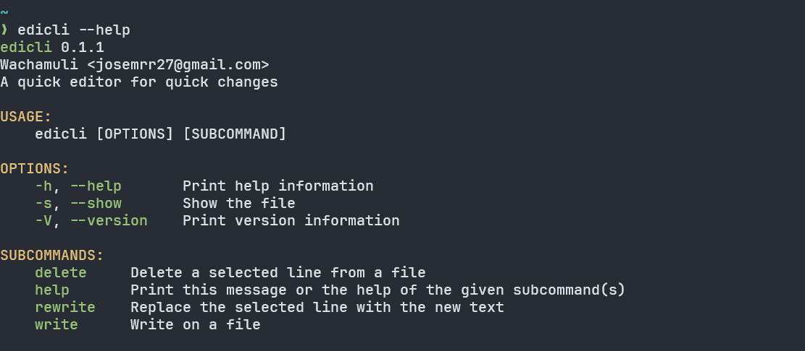
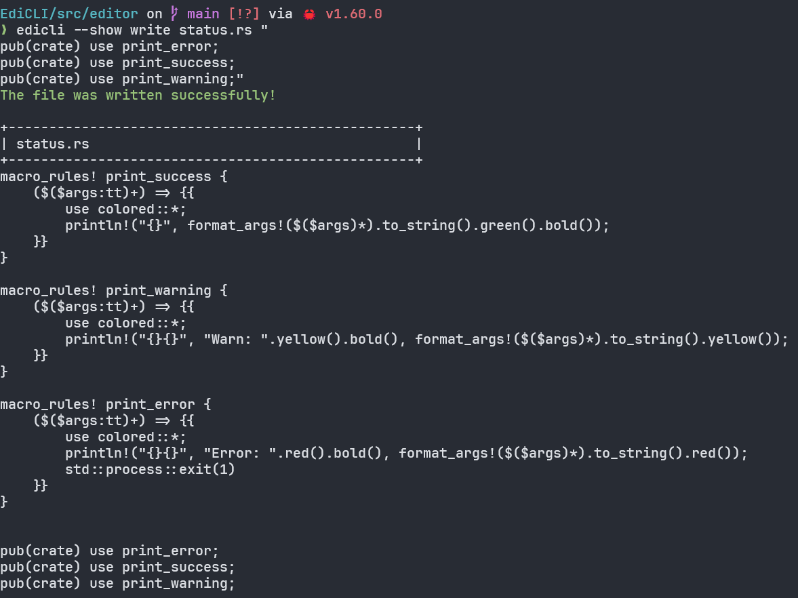
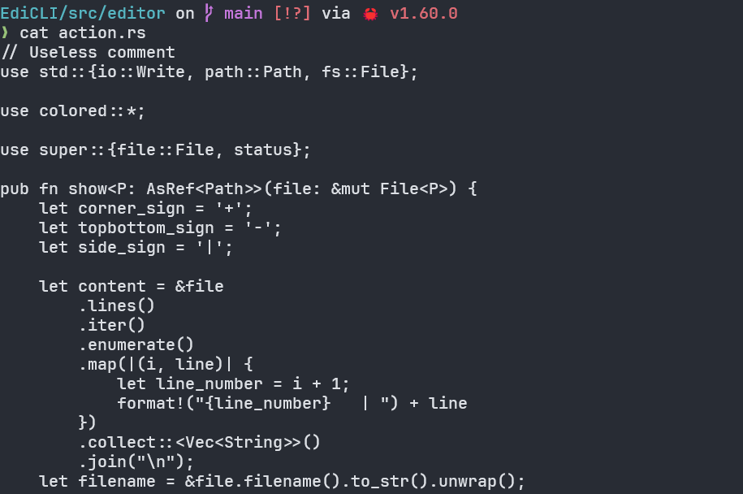
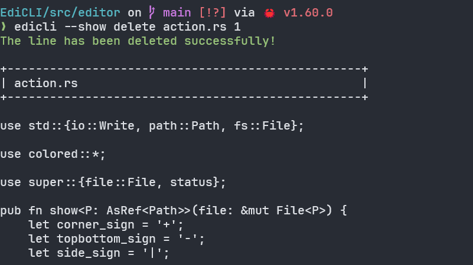
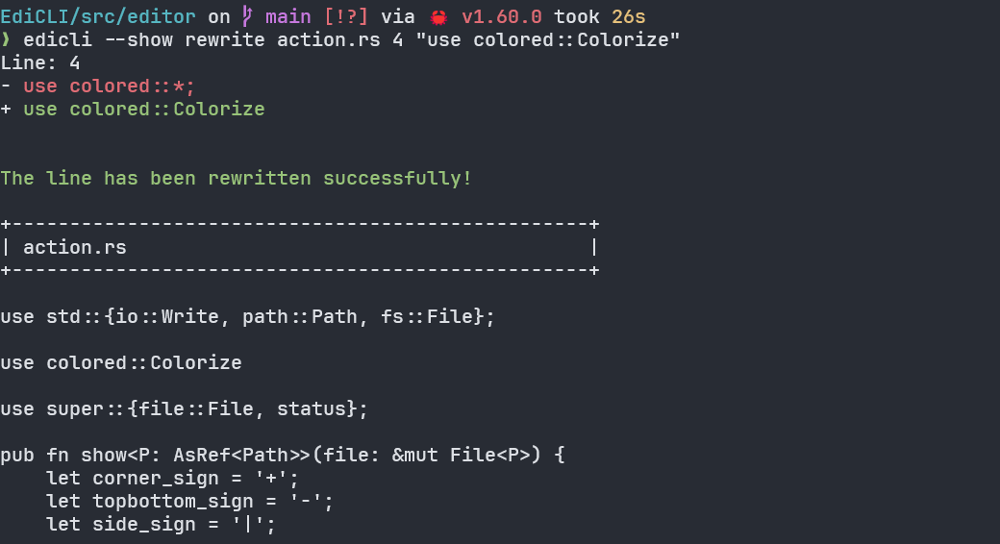

# EdiCLI

A.K.A. Editor Command Line Parser is a lightweight CLI text editor,
after all, *a quick editor for quick changes*. You don't have to use
a full featured text editor or IDE to just delete or add a line on a file.
If you are on my side then, download and install EdiCLI and run `edicli --help`
to see a list with the all awesome commands availables.

## Setup

First of all, clone the repository with the following command:
```
git clone https://github.com/Wachamuli/EdiCLI.git
```
Move the project folder to ``~/.local/bin/`` directory (optional):
```
mv EdiCLI ~/.local/bin/
```
Now create a symbolic link to the binay file:
```
ln -s EdiCLI/target/realease/edicli edicli
```
Try a command to check if EdiCLI is working properly, for example:
```
edicli --help
```


## Showcase

Edicli is based on three simple commands: `write`, `rewrite` and `delete`.
And one aditional flag `--show` or `-s` in short. Every command needs an input file but the 
arguments may vary.


```
edicli write <file> <text>
```



```
edicli delete <file> <line>
```


```
edicli rewrite <file> <line> <text>
```